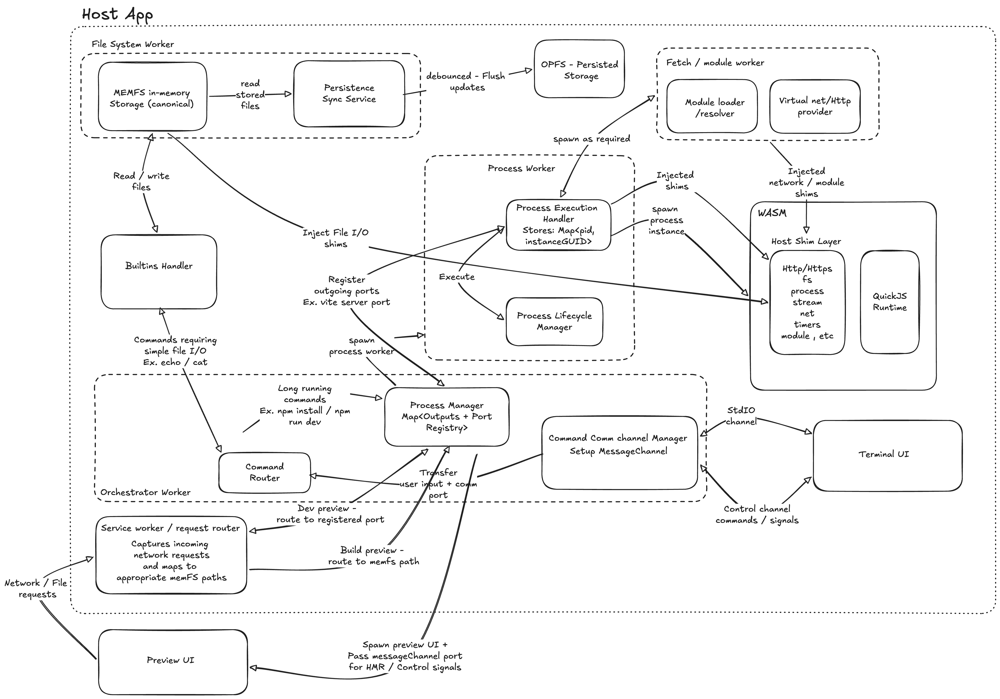

# Proposal: Browser-Native Runtime

## 1. Problem Statement

Build a production-grade browser runtime that provides filesystem-like host bindings to WASM and supports practical developer workflows:

- simple file commands (`echo`, `cat`)
- dependency installation (`npm install`)
- development server execution (`npm run dev`)

The system must prioritize:

- memory safety and predictable resource limits
- strong error handling and deterministic failure behavior
- low-latency developer experience
- compatibility with common JS tooling
- durable workspace persistence across sessions

### Scope

- Multi-process capable runtime with one active foreground process; background processes are supported.
- Same-origin preview routing.
- Progressive compatibility expansion for Node-like APIs.

### Non-Goals (initial production release)

- Full Node.js parity.
- Multi-tenant remote execution.
- Full POSIX-style job-control parity (`bg`, `fg`, `jobs`) in the first release.

## 2. Proposed Solution

Adopt a layered architecture with clear ownership boundaries:

- `memfs` in a dedicated filesystem worker is the canonical runtime filesystem.
- WASM is the high-performance execution boundary and shim host.
- QuickJS (inside WASM) executes user/tooling JS workloads.
- OPFS provides durable persistence for workspace and cache state.
- Orchestrator worker manages process lifecycle, routing, and control signals.
- Service Worker handles preview ingress and request routing.
- SharedArrayBuffer is used for high-throughput data exchange between worker and WASM runtime to reduce copy overhead; Atomics are used for coordination/backpressure where needed.

### Why this design

- Tooling compatibility: `memfs` offers Node-style FS semantics with minimal adaptation.
- Isolation: workers prevent long-running or faulty processes from blocking control-plane logic.
- Performance: WASM is used where acceleration provides measurable benefit.
- Reliability: deterministic state ownership reduces race conditions and corruption risk.

### Key principles

- One canonical source of truth for runtime files (`memfs`).
- Explicit backpressure and queueing between all channels.
- Fail closed on invalid session/route/control tokens.
- All process exits produce terminal-visible reason codes.

## 3. Proposed Architecture

The architecture separates control-plane, data-plane, and execution responsibilities across dedicated workers.  
`memfs` in the filesystem worker is the canonical runtime store, while OPFS provides durable checkpointed persistence.  
Process workers execute long-running commands through WASM + QuickJS with host-injected shims for filesystem, module, and virtual network APIs.  
A Service Worker handles preview ingress and routes dev/build requests through orchestrator-owned port and session state, with `MessageChannel` used for control and HMR signaling.

### 3.1 Runtime topology

- Terminal UI (main thread)
- Orchestrator Worker (control plane)
- Filesystem Worker (`memfs` + sync service)
- Process Worker(s) (on-demand execution)
- WASM + QuickJS runtime
- Fetch/Module Worker (resolution/network abstractions)
- Service Worker (preview ingress/router)
- Preview UI (iframe by default, new tab optional)

### 3.2 Data ownership and boundaries

- Filesystem ownership: Filesystem Worker only.
- Process ownership: Orchestrator + Process Worker.
- Route ownership: Orchestrator `PortRegistry` (`sessionId + port`).
- Persistence ownership: Filesystem Worker sync service.

### 3.3 Networking model

- No raw browser TCP sockets are assumed.
- Dev-server ports are virtual ports registered in orchestrator state.
- Service Worker routes preview requests:
  - dev preview -> process route via `PortRegistry`
  - build preview -> static artifact path in `memfs`

### 3.4 Reliability model

- Process failures are isolated to process workers.
- Port registration is lifecycle-bound to process state.
- On process exit/Ctrl+C:
  - unregister route
  - close associated channels
  - return clear terminal status

### 3.5 Security model

- Same-origin and SW-scope constrained preview.
- Session-scoped capability token on preview operations.
- Strict message schema validation for all worker and preview channel traffic.

### Deployment Requirements
- SharedArrayBuffer usage requires cross-origin isolation in production deployments.
- The host must serve with:
    - Cross-Origin-Opener-Policy: same-origin
    - Cross-Origin-Embedder-Policy: require-corp (or credentialless)

## 4. Core Components

### 4.1 Terminal UI

- Tech stack: browser UI on main thread.
- Purpose: command capture, output rendering, signal dispatch (Ctrl+C).
- Lifecycle: User initialized, tears down channels on session close.
- Assumptions: Terminal rendering supports streaming output without blocking input. Ex. Xterm.js

### 4.2 Orchestrator Worker

- Tech stack: dedicated worker.
- Purpose: command routing, process lifecycle, foreground process control, route registry.
- Lifecycle: long-lived for the session.
- Operational Considerations:
  - authoritative state machine for process states (`starting`, `running`, `stopping`, `exited`)
  - rejects duplicate/invalid route registration

### 4.3 Filesystem Worker (`memfs` Canonical)

- Tech stack: dedicated worker + `memfs`.
- Purpose: canonical runtime FS for reads/writes and metadata.
- Lifecycle: boot from OPFS snapshot, serve runtime RPC, flush changes (debounced).
- Operational Considerations:
  - single-writer strategy for consistency
  - path normalization + traversal safeguards

### 4.4 Persistence Sync Service (OPFS)

- Tech stack: OPFS API + incremental sync logic.
- Purpose: durability for workspace and package cache.
- Lifecycle: debounced flush + explicit checkpoints (process exit, install completion).
- Operational Considerations:
  - flush file changes to OPFS in batches

### 4.5 Process Worker

- Tech stack: dedicated worker spawned on demand.
- Purpose: execute long-running tooling commands in isolation.
- Lifecycle: spawn -> run -> stream output -> terminate -> cleanup.
- Operational Considerations:
  - Limit number of concurrent process to ensure fair memory usage
  - hard timeout and memory-pressure termination policies

### 4.6 WASM Runtime + Host Shim Layer

- Tech stack: Emscripten-built WASM module and JS host bindings.
- Purpose:
  - execute runtime logic with explicit / pre-defined host access via SharedArrayBuffers where possible
  - expose shims (`fs`, `process`, `module`, `http/net`, `timers`, `stream`)
  - enforce memory limits for accelerated operations
- Lifecycle: initialized by process worker, reused or recreated by policy.
- Operational Considerations:
  - explicit error translation from WASM exceptions to structured host errors
  - track memory allocation failures and peak memory usage

### 4.7 QuickJS Runtime

- Tech stack: QuickJS embedded in WASM.
- Purpose: run user/tool scripts in a controlled JS runtime.
- Lifecycle: process-scoped instance (default) with optional pooling later.
- Operational Considerations:
  - strict module-resolution contract through host resolver
  - deterministic teardown to avoid leaked handles

### 4.8 Fetch/Module Worker

- Tech stack: dedicated worker activated / loaded on-demand.
- Purpose: module resolution/loading and network abstraction support.
- Lifecycle: on-demand or always-on depending on startup policy.
- Operational Considerations:
  - retry/backoff for registry fetches
  - cache-aware fetch path for package artifacts

### 4.9 Service Worker / Request Router

- Tech stack: Service Worker activated / loaded on-demand (when a preview is required).
- Purpose: preview ingress, route dispatch for dev/build preview paths.
- Lifecycle: install/activate when required, handles controlled-client fetches.
- Operational Considerations:
  - should remain stateless for routing decisions
  - route resolution delegated to orchestrator authority

### 4.10 Preview UI

- Tech stack: same-origin iframe (default) or new tab.
- Purpose: render app output and receive HMR/control messages.
- Lifecycle: launched by host app when preview starts, closed on process stop.
- Operational Considerations:
  - target-origin checks required for `postMessage`
  - reconnect strategy for transient route resets

## 5. Proposed Flows

### 5.a `echo` / `cat`

1. Terminal sends parsed command to orchestrator control channel.
2. Orchestrator routes command to builtins handler.
3. Builtins handler calls filesystem worker RPC.
4. `echo` writes to `memfs`; `cat` reads from `memfs`.
5. Result is streamed to terminal via stdio channel.
6. Filesystem sync service marks dirty state and schedules OPFS checkpoint.

### 5.b `npm install`

1. Terminal sends `npm install`.
2. Orchestrator classifies as long-running and spawns process worker.
3. Process worker initializes WASM + QuickJS runtime.
4. Runtime reads project manifests through FS shim (`memfs` backend).
5. Fetch/module worker resolves versions and downloads required artifacts.
6. Integrity/compute-heavy like tarball extraction can be delegated to WASM helpers.
7. Extracted package tree is written to `memfs/node_modules`.
8. Logs/progress are streamed to terminal continuously.
9. On success/failure:
  - update lock and metadata state
  - trigger persistence checkpoint to OPFS
  - emit exit code and reason to terminal

### 5.c `npm run dev`

1. Terminal sends `npm run dev`.
2. Orchestrator spawns process worker and starts Vite process in runtime.
3. Vite calls virtual `listen(5173)` via net/http shim.
4. Orchestrator registers `{sessionId, port}` in `PortRegistry`.
5. Host opens Preview UI (iframe by default) at preview route.
6. Service Worker intercepts preview requests and resolves route through orchestrator.
7. Requests are forwarded to process handle; Vite serves transformed modules from `memfs`.
8. Response flows back to Preview UI through the same routed path.
9. HMR/control events flow over dedicated `MessageChannel`.
10. Ctrl+C or process exit triggers cleanup:
  - process termination
  - route unregister
  - channel close
  - terminal prompt restore

